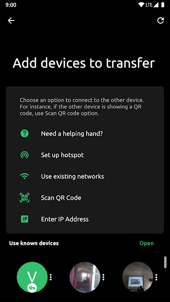

# TrebleShot
### A file-sharing tool for mobile, desktop & browsers.
An Open-Source Android application that allows you to send and receive files over available connections, and offers unique features like sharing over HTTP, pausing and resuming transfers.  
#### Download it from-  
**_[GitHub](https://github.com/trebleshot/android)_**     
**_[Play Store](https://play.google.com/store/apps/details?id=com.genonbeta.TrebleShot)_**     
#### It's main features-  
1. Resume Transfers-  
Pause and resume transfers even after something went wrong.  
2. Multiple Devices  
Share with multiple devices at the same time.  
3. No Internet  
No internet connection is required, setup a hotspot and connect to it using QR code.  
4. Speed-Oriented  
Works faster than its rivals on low-end devices. Minimal UI optimized for speed.  
5. Large Files  
Great support for files with larger than average sizes.  
  
      
#### Find devices with ease   
TrebleShot provides handful tools to help you send any file on any situation. Devices that are on the same network will recognize each other. You can also scan the code over your phone's screen or start a deep scan over the network.    
#### Contribution   
- Just fork the repository  
- Add your suggestions  
- Send us a pull request  
- We will look through it :)  
